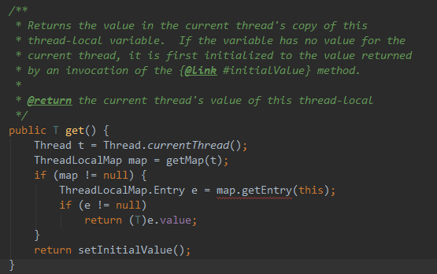
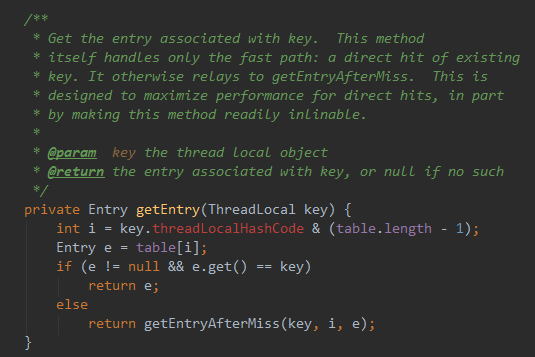
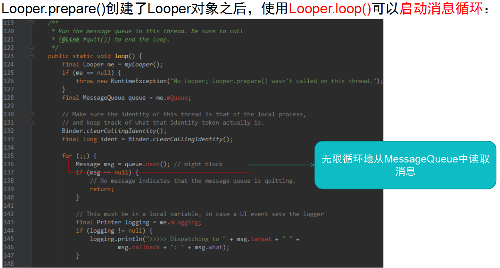

# Android面试知识点归纳(2) 

<h3 id="index">目录</h3>

* [Handler原理](#Handler原理)
* [内存泄露以及优化](#内存泄露以及优化)


<h2 id="内存泄露以及优化">内存泄露以及优化</h2>

内存泄露：当一个对象已经不需要再使用了，本该被回收时，而有另外一个正在使用的对象持有它的引用从而导致它不能被回收，这导致本该被回收的对象不能被回收而停留在堆内存中，这就产生了内存泄漏。

### Android系统内存分配与回收

* 一个APP就是一个Linux进程，同时也是一个JVM中的进程。Andorid中的APP进程都是由Linux的**Zygote进程** fork出来的。
* GC(垃圾回收器)只有在Heap剩余空间不够的时候才发出垃圾回收。引入GC的优点就是不需要我们手动的进行垃圾回收。但是GC的缺点就是，APP在运行过程中不断的申请内存分配，当发现系统分配给我们的Heap不够用了，然后才进行垃圾回收。
* GC触发时，所有的线程都会被暂停。

APP的内存限制机制：

* 系统会默认给每个APP设置一个最大的内存限制，随不同设备而不同。（通常会是256M）
* 吃内存大户：图片。

切换应用时后台APP清理机制：

* Android是使用分时复用的方式，可以多个应用同时运行，在前台与用户交互的只有一个，在后台运行的可以有多个。APP切换时是采用**LRU** (Least recently used,最近最少使用) 方式，最近使用的排在最前面，被清理的可能性最小。排在末尾的最有可能被清理。
* 当系统清理后台进程时，会触发Activity 的 `onTrimMemory()` 方法。

### APP内存优化方法 

1.对于生命周期比Activity长的对象如果需要应该使用ApplicationContext。

2.对于需要在静态内部类中使用**非静态外部成员变量** （如：Context、View )，可以在静态内部类中使用**弱引用** 来引用外部类的变量来避免内存泄漏。

3.对于不再需要使用的对象，显示的将其赋值为null，比如使用完Bitmap后先调用recycle()，再赋为null。

4..保持对对象生命周期的敏感，特别注意单例、静态对象、全局性集合等的生命周期。

5.对于生命周期比Activity长的内部类对象，并且内部类中使用了外部类的成员变量，可以这样做避免内存泄漏：

* 将内部类改为静态内部类
* 静态内部类中使用弱引用来引用外部类的成员变量

6.数据结构优化：(1)频繁地拼接字符串应该使用StringBuilder，而不应该采用+的方式（该方式会产生很多的中间字符串）。(2)使用ArrayMap ,SparseArray替换HashMap，效率更高。(3)内存抖动：由于变量使用不当，在短时间内申请了大量的内存，用完后便马上弃之不用。过了一会又去申请大量内存，用完再弃之不用。应该尽量避免内存抖动。(4)注意：再小的Class都会耗费0.5KB。HashMap里一个entry需要额外占用32B。

7.对象复用：(1)复用系统自带的资源。(2)ListView/GridView的ConvertView复用。(3)避免在onDraw()里面执行对象的创建。

8.避免内存泄露：内存泄露会导致剩余可用的Heap越来越少，频繁触发GC。(1)在使用Context的地方，尽量用Applicaion Context而不是 Activity Context。(2)在执行数据库相关操作时，将Cursor对象及时关闭。(3)Bitmap的在不用的时候应及时调用`recycle()`。

### OnTrimMemory()

Activity的`onTrimMemory(int level)` ，level有以下几个常量值：

* TRIM_MEMORY_BACKGROUND：表示该APP当前是处于后台，已经被放在了LRU队列中。
* TRIM_MEMORY_COMPLETE：表示该应用已经处于LRU队列的末端，如果手机内存紧张的时候就会被清除掉。这是最危险的级别。
* TRIM_MEMORY_MODERATE：表示当前应用处于LRU的中部，内存紧张时还暂时不会KILL该进程。
* TRIM_MEMORY_RUNNING_MODERATE：表示应用程序正常运行，并且不会被杀掉。但是目前手机的内存已经有点低了，系统可能会开始根据LRU缓存规则来去杀死进程了。
* TRIM_MEMORY_RUNNING_LOW ：表示应用程序正常运行，并且不会被杀掉。但是目前手机的内存已经非常低了，我们应该去释放掉一些不必要的资源以提升系统的性能，同时这也会直接影响到我们应用程序的性能。
* TRIM_MEMORY_RUNNING_CRITICAL：表示应用程序仍然正常运行，但是系统已经根据LRU缓存规则杀掉了大部分缓存的进程了。这个时候我们应当尽可能地去释放任何不必要的资源，不然的话系统可能会继续杀掉所有缓存中的进程，并且开始杀掉一些本来应当保持运行的进程，比如说后台运行的服务。 
* TRIM_MEMORY_UI_HIDDEN：点击了Home键之后，会收到这个级别的通知。


<h2 id="Handler原理">Handler原理</h2>

### ThreadLocal 

ThreadLocal是一个**线程内部的数据存储类** ，实质上是一个泛型类，定义为：public class ThreadLocal<T>。通过它可以在某个指定线程中存储数据，数据存储以后，只有在**指定线程(存储数据的线程)** 中可以获取到它存储的数据，对于其他的线程来说无法获取到它的数据。

通过使用ThreadLocal，能够让同一个数据对象在不同的线程中存在多个副本，而这些副本互不影响。Looper的实现中便使用到了ThreadLocal。通过使用ThreadLocal，每个线程都有自己的Looper，它们是同一个数据对象的不同副本，并且不会相互影响。

ThreadLocal中有一个内部类ThreadLocalMap，ThreadLocal中有一个内部类Entry，Entry中的`Object value `这个value实际上就是每一个线程中的数据副本。ThreadLocalMap中有一个存放Entry的数组：`Entry[] table`。 ThreadLocal类的部分代码如下：


ThreadLocal的`set` 方法：实际上就是往ThreadLocalMap对象(map)维护的对象数组table中插入数据。


ThreadLocal的`get` 方法，调用了ThreadLocalMap的getEntry()方法：



ThreadLocalMap的`getEntry()` 方法:



i的值是由线程的哈希码和（table的长度-1）进行“按位与”运算，所有每个线程得到的i是不一样的，因此最终数据副本在table中的位置也不一样。

### MessageQueue 

MessageQueue主要包含两个操作，插入和读取。读取操作的函数是`next()` ，该操作同时也会伴随着删除操作(相当于出队列)，插入操作对应的函数是`enqueueMessage()` ，`enqueueMessage()` 实际上就是单链表的插入操作。`next()` 方法是一个无限循环的方法，如果消息队列中没有消息，那么next()方法会一直阻塞。当有新消息到来时，next()方法会返回这条消息并将其从单链表中移除。 

### Looper

Looper在Android的消息机制中扮演着消息循环的角色，它会不停地从MessageQueue中查看是否有新的Message到来，如果有新消息就会立刻处理，否则就一直阻塞在那里。一个线程只能有一个Looper对象，从而也只有一个MessageQueue(在Looper的构造方法初始化)。

Looper中的几个重要的成员变量：


Looper的构造方法，在构造方法中，创建了一个**MessageQueue** 实例：


当需要为一个线程创建Looper对象时，需要调用Looper的`prepare()` 方法（该方法在一个线程中只能调用一次，否则会抛出异常）：


在`loop()` 的消息循环中，实际上是调用了MessageQueue的**next()** 方法。




Looper主要作用：
1、	与当前线程绑定，保证一个线程只会有一个Looper实例，同时一个Looper实例也只有一个MessageQueue。
2、	loop()方法，不断从MessageQueue中去取消息，交给消息的target属性的dispatchMessage去处理。

### Handler 

Handler的工作主要是消息的发送和消息接收处理。消息的发送可以通过Handler的`post()` 方法或者`sendMessage()` 方法来实现，消息的处理，需要我们重写handleMessage()函数来进行处理。

Handler的sendMessage()函数：


最后调用了MessageQueue的`enqueueMessage()` 函数：


Message 的callback成员变量实际上是一个**Runnable对象** ：

`Runnable callback; ` 

经常使用的Handler的`post(Runnable r)` 方法，源码是这样的：

```java

    public final boolean post(Runnable r)
    {
       return  sendMessageDelayed(getPostMessage(r), 0);
    }
```

其中，`getPostMessage(r) ` 为：

```java
private static Message getPostMessage(Runnable r) {
        Message m = Message.obtain();
        m.callback = r;
        return m;
    }
```

原来，Handler的`post()`方法实际上是把这个Runnable对象封装到了一个Message中的。

因此，Handler中的事件处理优先级顺序是：

Message.callback(Runnable) -- >  mCallback(Callback接口实现类或Callback匿名内部类)  --->  Handler或其子类的handleMessage()。


[回到目录](#index)

##  


## 热修复 

