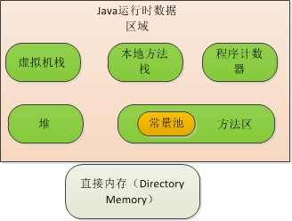
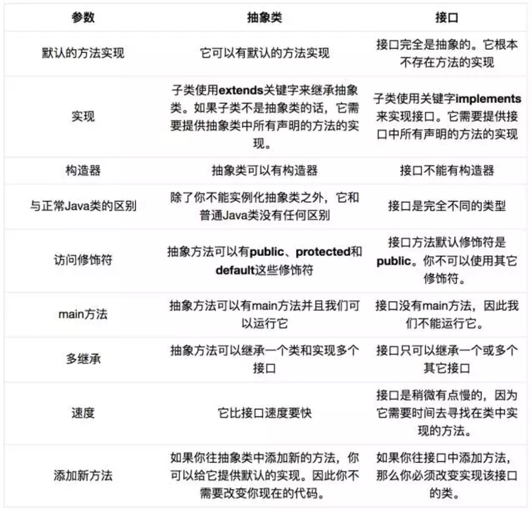

# JAVA面试常考知识点

[TOC]

## 面向对象的特征

- **抽象**：抽象是将一类对象的共同特征总结出来构造类的过程，包括数据抽象和行为抽象两方面。抽象只关注对象有哪些属性和行为，并不关注这些行为的细节是什么。
- **继承**：继承是**从已有类得到继承信息创建新类的过程**。提供继承信息的类被称为父类(超类、基类);得到继承信息的类被称为子类(派生类)。继承让变化中的软件系统有了一定的延续性，同时继承也是封装程序中可变因素的重要手段。
- **封装**：通常认为封装是**把数据和操作数据的方法绑定起来，对数据的访问只能通过已定义的接口**。面向对象的本质就是将现实世界描绘成一系列完全自治、封闭的对象。我们在类中编写的方法就是对实现细节的一种封装;我们编写一个类就是对数据和数据操作的封装。可以说，封装就是隐藏一切可隐藏的东西，只向外界提供最简单的编程接口。
- **多态性**：多态性是指**允许不同子类型的对象对同一消息作出不同的响应**。简单的说就是用同样的对象引用调用同样的方法但是做了不同的事情。多态性分为编译时的多态性和运行时的多态性。**方法重载**(overload)实现的是**编译时的多态性**(也称为前绑定)，而**方法重写**(override)实现的是**运行时的多态性**(也称为后绑定)。运行时的多态是面向对象最精髓的东西，要实现多态需要做两件事：1). 方法重写(子类继承父类并重写父类中已有的或抽象的方法);2). 对象造型(用父类型引用引用子类型对象，这样同样的引用调用同样的方法就会根据子类对象的不同而表现出不同的行为)。

## 垃圾回收机制GC

**如果一个对象，没有任何引用指向它，那么它就被认为是一个垃圾** 。

**垃圾回收回收的是无任何引用的对象占据的内存空间而不是对象本身**

GC是垃圾回收的意思（gabage collection），内存处理器是编程人员容易出现问题的地方，忘记或者错误的内存回收导致程序或者系统的不稳定甚至崩溃，java的GC功能可以自动监测对象是否超过作用域从而达到自动回收内存的目的。

显式通知JVM进行一次垃圾回收:

```java
System.gc()
  或
Runtime.getRuntime().gc()  
```


* 强引用

强引用是最常见的引用。比如

`StringBuffer buffer = new StringBuffer();`

创建了一个StringBuffer类的对象，并用一个变量buffer存储对这个对象的引用。这就是个强引用。当内存空间不足，[Java](http://www.2cto.com/kf/ware/Java/)[虚拟机](http://www.2cto.com/os/xuniji/)宁愿抛出OutOfMemoryError错误，使程序异常终止，也不会靠随意回收具有强引用的对象来解决内存不足的问题。

* 软引用（SoftReference）

如果一个对象只具有软引用，则内存空间足够，垃圾回收器就不会回收它；**如果内存空间不足了，就会回收这些对象的内存**。只要垃圾回收器没有回收它，该对象就可以被程序使用。软引用可用来实现内存敏感的高速缓存。

* 弱引用（WeakReference)

弱引用与软引用的区别在于：弱引用的对象拥有更短暂的生命周期。在垃圾回收器线程扫描它所管辖的内存区域的过程中，**一旦发现了只具有弱引用的对象，不管当前内存空间足够与否，都会回收它的内存**。不过，由于垃圾回收器是一个优先级很低的线程，因此不一定会很快发现那些只具有弱引用的对象。

* 虚引用（PhantomReference）

“虚引用”顾名思义，就是形同虚设，与其他几种引用都不同，虚引用并不会决定对象的生命周期。如果一个对象仅持有虚引用，那么它就和没有任何引用一样，**在任何时候都可能被垃圾回收器回收**。
虚引用主要用来跟踪对象被垃圾回收器回收的活动。虚引用与软引用和弱引用的一个区别在于：虚引用必须和引用队列（ReferenceQueue）联合使用。当垃圾回收器准备回收一个对象时，如果发现它还有虚引用，就会在回收对象的内存之前，把这个虚引用加入到与之 关联的引用队列中。

### 区分垃圾的策略

1.引用计数法

​       堆中每一个对象都有一个引用计数。当新创建一个对象，或者有变量被赋值为这个对象的引用，则这个对象的引用计数加1；当一个对象的引用超过生存期或者被设置一个新的值时，这个对象的引用计数减1。当对象的引用计数变为0时，就可以被当作垃圾收集。
​         这种方法的好处是垃圾收集较快，适用于实时环境。缺点是这种方法无法监测出循环引用。例如对象A引用对象B，对象B也引用对象A，则这两个对象可能无法被垃圾收集器收集。因此这种方法是垃圾收集的早期策略，现在很少使用。

2.跟踪法

​     这种方法把每个对象看作图中一个节点，对象之间的引用关系为图中各节点的邻接关系。垃圾收集器从一个或数个根结点遍历对象图，如果有些对象节点永远无法到达，则这个对象可以被当作垃圾回收。
​     容易发现，这种方法可以检测出循环引用，避免了引用计数法的缺点，较为常用。

### 垃圾回收算法

1.标记－清除收集器

​      这种收集器首先遍历对象图并标记可到达的对象，然后扫描堆栈以寻找未标记对象并释放它们的内存。这种收集器一般使用单线程工作并停止其他操作。

2.标记－压缩收集器

​    有时也叫标记－清除－压缩收集器，与标记－清除收集器有相同的标记阶段。在第二阶段，则把标记对象复制到堆栈的新域中以便压缩堆栈。这种收集器也停止其他操作。

3.复制收集器

​     这种收集器将堆栈分为两个域，常称为半空间。每次仅使用一半的空间，虚拟机生成的新对象则放在另一半空间中。垃圾回收器运行时，它把可到达对象复制到另一半空间，没有被复制的的对象都是不可达对象，可以被回收。这种方法适用于短生存期的对象，持续复制长生存期的对象由于多次拷贝，导致效率降低。缺点是只有一半的虚拟机空间得到使用。

4.增量收集器

   增量收集器把堆栈分为多个域，每次仅从一个域收集垃圾。这会造成较小的应用程序中断。

5.分代收集器

​    这种收集器把堆栈分为两个或多个域，用以存放不同寿命的对象。虚拟机生成的新对象一般放在其中的某个域中。过一段时间，继续存在的对象将获得使用期并转入更长寿命的域中。分代收集器对不同的域使用不同的[算法](http://lib.csdn.net/base/datastructure)以优化性能。这样可以减少复制对象的时间。

6.并发收集器

​       并发收集器与应用程序同时运行。这些收集器在某点上（比如压缩时）一般都不得不停止其他操作以完成特定的任务，但是因为其他应用程序可进行其他的后台操作，所以中断其他处理的实际时间大大降低。

7.并行收集器

​       并发收集器与应用程序同时运行。这些收集器在某点上（比如压缩时）一般都不得不停止其他操作以完成特定的任务，但是因为其他应用程序可进行其他的后台操作，所以中断其他处理的实际时间大大降低。

8.自适应收集器

 根据程序运行状况以及堆的使用状况，自动选一种合适的垃圾回收算法。这样可以不局限与一种垃圾回收算法。

## 访问修饰符public,private,protected,以及不写(默认)时的区别?

```java
修饰符    当前类  同 包  子 类    其他包
public     √     √      √       √
protected  √     √      √       X
default    √     √      X       X
private    √     X      X       X
```


## 基本的数据类型

Java中的基本数据类型只有8个：

byte：1字节  boolean：1字节  

short：2字节   char：2字节    

int ：4字节   float：4字节

long：8字节   double：8字节

除了基本类型(primitive type)和枚举类型(enumeration type)，剩下的都是引用类型(reference type)。


## int 和Integer

Java是一个近乎纯洁的面向对象编程语言，但是为了编程的方便还是引入了基本数据类型，但是为了能够将这些基本数据类型当成对象操作，Java为每一个基本数据类型都引入了对应的包装类型(wrapper class)，int的包装类就是Integer，从Java 5开始引入了自动装箱/拆箱机制，使得二者可以相互转换。

Java 为每个原始类型提供了包装类型：

原始类型: boolean，char，byte，short，int，long，float，double

包装类型：Boolean，Character，Byte，Short，Integer，Long，Float，Double

```java
Integer f1 = 100, f2 = 100, f3 = 150, f4 = 150;
System.out.println(f1 == f2);//true
System.out.println(f3 == f4);//false
```

整型字面量的值在-128到127之间，那么不会new新的Integer对象，而是**直接引用常量池中的Integer对象**。


## 栈、堆、方法区、常量池

**每一个Java应用都唯一对应一个JVM实例，每一个实例唯一对应一个堆。每个线程包含一个栈区**。

1.**栈**

（1）栈中只保存**基础数据类型的对象** 和**自定义对象的引用型数据**，对象都存放在堆区中。
（2）每个栈中的数据（原始类型和对象引用）都是**线程私有**的，其他栈不能访问。
（3）栈分为3个部分：基本类型变量区、执行环境上下文、操作指令区（存放操作指令）。
（4）stack的区域很小，只有1M，特点是存取速度很快，所以在stack中存放的都是快速执行的任务，比如static变量，static方法，基本数据类型的数据，和对象的引用(reference)。

2.**堆**

（1）存储的全部是对象的实例，每个对象都包含一个与之对应的class的信息。（class的目的是得到操作指令）。
（2）每个jvm实例只有一个堆区（heap）被所有线程共享，堆中不存放基本类型和引用型变量，只存放**对象实例**本身。

3.**方法区**

方法区跟堆一样，**被所有的线程共享**。用于存储已被虚拟机加载的**类信息、常量、静态变量、即时编译器编译后的代码** 等数据。

方法区又叫**静态区** ，存放所有的class和静态变量，方法区存放的是整个程序中唯一的元素，如class和static变量。

4.**常量池**

**常量池是方法区的一部分。**

**常量池**用于存放**编译期生成的** 各种**字面量**和**符号引用（还有翻译出来的直接引用）**，这部分内容**在类加载后进入方法区** 的运行时常量池中存放。

常量池指的是在编译期被确定，并被保存在已编译的.class文件中的一些数据。除了包含代码中所定义的各种基本类型（如int、long等等）和对象型（如String及数组）的常量值(final)还包含一些**以文本形式出现的符号引用**，比如：**类和接口的全限定名； 字段的名称和描述符； 方法和名称和描述符**。

虚拟机必须为每个被装载的类型维护一个常量池。常量池就是该类型所用到常量的一个有序集和，包括直接常量（string,integer和floating point常量）和对其他类型，字段和方法的符号引用。对于String常量，它的值是在常量池中的。而JVM中的常量池在内存当中是以表的形式存在的，对于String类型，有一张固定长度的CONSTANT_String_info表用来存储文字字符串值，注意：该表只存储文字字符串值，不存储符号引用。在程序执行的时候,常量池会储存在方法区（Method Area）,而不是堆中。

总之，常量池包含四种数据：**基本数据类型的常量值** ，**对象型的常量值** (String和数组)，**以文本形式出现的符号引用** (类和接口的全限定名，字段名和描述符，方法名和描述符)。   



## JVM中类的加载机制

包括三个步骤：加载、连接、初始化。

1.加载

类的加载是指**将类的class文件读入内存中，并为之创建一个java.lang.Class对象** ，也就是当程序使用任何类是，系统都会为之建立一个java.lang.Class对象。

类的加载使用类加载器完成，JVM提供了四种类加载器以完成类的加载：

* bootstrapClassLoader :主要加载java核心api
* ExtClassLoaders：扩展类的类加载器
* AppClassLoader ：程序类加载器，负责加载classpath 中指定的jar包及目录中的class
* 用户继承ClassLoader重写的类加载器

  ​

通常可以使用不同的类加载器从不同的来源加载类的二进制数据：

* 从本地文件系统加载class文件，这是通常情况下的类加载方式
* 从jar包加载class文件，这种方式也是很常见的，例如：JDBC编程时用到的数据库驱动加载`Class.forName("");`就是放在jar包中，JVM可以从jar中直接加载改class文件。
* 通过网络加载class文件
* 把一个java源文件动态编译，并执行加载

类加载器通常无需等到“首次使用”该类时才加载该类，Java虚拟机规范允许系统预先加载某些类。

2.连接

当类被加载后，系统会生成一个对应的Class对象，接着将会进入到连接阶段，连接阶段负责把类的二进制数据合并到JRE中。类连接又可分为以下三个阶段：

(1)验证：验证阶段由于检查被加载的类的内部结构是否正确，并协调与其他类的关系型

(2)准备：负责为类变量分配内存，并设置默认的初始值

(3)解析：将类的二进制数据中的符号引用替换为直接引用

3.初始化

虚拟机负责对类进行初始化，主要是对类变量的初始化。在Java类中对类变量之低昂初始值有两种方式：①声明类变量时指定初始值；②使用静态初始化块为类变量指定初始值。

## Java函数调用时，函数参数实际是值传递

Java语言的方法调用只支持参数的值传递。当传入的是基本数据类型时，此时传递的是一份数值的拷贝。引用类型传递的引用对象的内存地址。

## **重载(Overload)和重写(Override)**

方法的重载和重写都是实现多态的方式，区别在于前者实现的是编译时的多态性，而后者实现的是运行时的多态性。

* 重载发生在一个类中，同名的方法如果有不同的参数列表(参数类型不同、参数个数不同或者二者都不同)则视为重载;注意，重载方法，**返回类型**可以相同的。
* 重写发生在子类与父类之间，重写要求子类被重写方法与父类被重写方法有相同的返回类型，比父类被重写方法更好访问，不能比父类被重写方法声明更多的异常(里氏代换原则)。重载对返回类型没有特殊的要求。

## 抽象类和接口的区别

* 接口里只能包含抽象方法，静态方法和默认方法，不能为普通方法提供具体的实现。抽象类可以为普通方法提供具体的实现。
* 接口里只能定义静态常量，不能定义普通成员变量。抽象类可以定义普通成员变量和静态变量。
* 接口里不包含构造器。抽象类可以包含构造器（抽象类里的构造器不是用于创建对象的，而是让其子类调用这些构造器来完成类的初始化）。
* 接口里不能包含初始化块，而抽象类里可以包含初始化块。
* 一个类最多只能有一个直接父类，包括抽象类，而一个类可以实现多个接口，通过实现多个接口来弥补Java单继承的不足。
* 抽象类中的成员可以是`private`、默认、`protected`、`public`的，而接口中的成员全都是`public`的。




## Static关键字

static 关键字可以用来修饰：

* **方法** ：被修饰的方法就变成了**静态方法**，静态方法从属于类而不是从属于某个对象，无需本类的对象即可调用此方法。声明为static的方法有以下几条限制：他们仅能调用其他的静态方法；仅能访问static数据；他们不能以任何方式引用this或super。
* **变量** ：被修饰的变量就变成了**静态变量**， 静态变量实质上就是全局变量，当声明一个对象时，并不产生static变量的拷贝，而是该类所有的实例变量共用同一个static变量。静态变量与静态方法类似。所有此类实例共享此静态变量，也就是说在类装载时，只分配一块存储空间，所有此类的对象都可以操控此块存储空间。
* **内部类** ：被修饰的内部类就变成了**静态内部类** ，它可以不依赖于外部类实例而被实例化。而通常的内部类需要在外部类实例化之后才能实例化。
* **静态代码块** ：被修饰的语句块是在类中独立于类成员的**static语句块** ，一般用于进行类的初始化操作，对一些静态变量赋值等。静态代码块可以有多个，位置可以随便放，它不在任何的方法体内，JVM加载类时会执行这些静态的代码块，如果static代码块有多个，JVM将按照它们在类中出现的先后顺序依次执行它们，每个代码块只会被执行一次。


## final关键字

final关键字可以用来修饰：

* **类** ：final类**不能被继承** ，因此final类的成员方法没有机会被覆盖，默认都是final的。在设计类时候，如果这个类不需要有子类，类的实现细节不允许改变，并且确信这个类不会载被扩展，那么就设计为final类。
* **变量** ：用final修饰的成员变量表示常量，一旦赋予了初始值就无法改变！final成员变量必须在声明的时候初始化或者在静态初始化块中初始化，或者在构造器中初始化，否则就会报编译错误。
* **方法** ：如果一个类**不允许其子类覆盖某个方法** ，则可以把这个方法声明为final方法。 使用final方法的原因有两个：
  ​        第一、把方法锁定，防止任何继承类修改它的意义和实现。
  ​        第二、高效。编译器在遇到调用final方法时候会转入内嵌机制，大大提高执行效率。
* **函数参数** ：当函数参数为final类型时，可以读取使用该参数，但是无法改变该参数的值。

下面总结了一些使用final关键字的好处：

1. final关键字提高了性能。JVM和Java应用都会缓存final变量。
2. final变量可以安全的在多线程环境下进行共享，而不需要额外的同步开销。
3. 使用final关键字，JVM会对方法、变量及类进行优化。

## 线程同步
### 使用synchronized修饰方法进行同步
如：
```java
int tickets = 10;
public synchronized void buyTicket(){
    tickets --;
}
```

synchronized关键字也可以修饰静态方法，当调用静态方法时，将会**锁住整个类** 。

### 使用synchronized 同步代码块
如：
```java
int tickets  = 10;
public void buyTicket(){
    synchronized(this){
        tickets--;
    }
}
```

### 使用volatile关键字实现同步
通常在多线程执行的时候，每个线程会先从内存中拷贝变量到CPU缓存中，因为每个线程可能在不同的CPU上进行处理，这就意味着同一个变量会被拷贝多次。这就造成了多线程并发访问无法同步的问题。而使用了volatile关键字的变量，JVM保证该变量每次读取都是从内存中读取，跳过CPU cache这一步，于是就达到了多个线程访问同一个变量的目的。

当一个变量被定义为volatile之后，将具备两种特性：
* 保证此变量对所有线程的即时可见性，当变量改变时，新值能立即同步到主存中，以及每次使用前立即从主存刷新。
* 禁止指令重排序优化。指令重排序指的是：CPU允许将多条指令不按规定的顺序分开发送给各电路单元处理。有了volatile修饰的变量，在其赋值语句后面会多一个`load addl $0x0, (%esp)` 操作，相当于加了一个**内存屏障** ，禁止了指令重排序，这样就不能把后面的指令重排序到内存屏障之前的位置。
示例：
```java
class Bank{
    private volatile int money = 100;

    public int getMoney(){
        return money;
    }
    public void saveMoney(int  m){
        money += m;
    }
}
```
volatile不提供任何原子操作，也不能用来修饰final类型的变量。

### 使用ReentrantLock
ReentrantLock是位于java.utl.concurrent包中，ReentrantLock是可重入，互斥，实现了Lock接口的锁。
ReentrantLock类的常用方法有：
* `ReentrantLock() ` ：创建一个ReentrantLock实例。
* `lock()`：获得锁
* `unlock()`：释放锁

使用示例：
```java
class Bank {
    private int account = 100;
    private Lock lock = new ReentrantLock();
    public int getAccount(){
        return account;
    }
    public void save(int money){
        lock.lock();
        try{
            account += money;
        }finally{
            lock.unlock();
        }
    }
}
```

### wait() 和 notify()
wait()用来让当前线程等待，会释放锁。
notify用来唤醒对应线程，让其继续执行。
在调用wait(), notify()或notifyAll()的时候，必须先获得锁，且状态变量须由该锁保护，而固有锁对象与固有条件队列对象又是同一个对象。也就是说，要在某个对象上执行wait，notify，先必须锁定该对象，而对应的状态变量也是由该对象锁保护的。
典型的wait()使用示例：
```java
public void test() throws InterruptedException {
    synchronized(obj) {
      while (! contidition) {
        obj.wait();
      }
    }
  }
```


## 深克隆和浅克隆

- **浅克隆** : 通常只是对克隆的实例进行复制，但里面的其他子对象，都是共用的。（被复制对象的所有变量都含有与原来的对象相同的值，而所有的对其他对象的引用仍然指向原来的对象。换言之，浅复制仅仅复制所考虑的对象，而不复制它所引用的对象。）
- **深克隆** : 克隆的时候会克隆它的子对象的引用，里面所有的变量和子对象都是又额外拷贝了一份。（被复制对象的所有变量都含有与原来的对象相同的值，除去那些引用其他对象的变量。那些引用其他对象的变量将指向被复制过的新对象，而不再是原有的那些被引用的对象。换言之，深复制把要复制的对象所引用的对象都复制了一遍。）

浅克隆：

```java
class Father implements Cloneable {  
    public String name;  
    public int age;  
    public Father(String name, int age) {  
        this.name = name;  
        this.age = age;  
    }    
}  

public class Child implements Cloneable {  
    public String name;  
    public int age;  
    public Father father;  
    public Child(String name, int age, Father father) {  
        this.name = name;  
        this.age = age;  
        this.father = father;  
    }      
    public Object clone() {  
        Child child = null;  
        try {  
            child = (Child) super.clone();  
        } catch (CloneNotSupportedException e) {  
            e.printStackTrace();  
        }  
        return child;  
    }  

   public static void main(String[] args) {  
        Father father = new Father("李刚", 44);  
        Child child1 = new Child("李小刚", 14, father);  
        Child child2 = (Child) child1.clone();  
        child2.father.name = "赵刚";  
        child2.father.age = 40;  
        child2.name = "赵小刚";  
        child2.age = 15;  
        System.out.println(child1.name + " " + child1.age);  
        System.out.println(child1.father.name + " " + child1.father.age);  
        System.out.println(child2.name + " " + child2.age);  
        System.out.println(child2.father.name + " " + child2.father.age);  
    }  
//  运行结果  
//  李小刚 14  
//  赵刚 40  
//  赵小刚 15  
//  赵刚 40  
//  浅克隆时father对象都是共用的，所以father重新赋值之后，之前的值也跟着变化。
}
```

深克隆：

```java
class Father implements Cloneable {  

    public String name;  
    public int age;  

    public Father(String name, int age) {  
        this.name = name;  
        this.age = age;  
    }  

    public Object clone() {  
        Father father = null;  
        try {  
            father = (Father) super.clone();  
        } catch (CloneNotSupportedException e) {  
            e.printStackTrace();  
        }  
        return father;  
    }  

}  

public class Child implements Cloneable {   
    private String name;  
    private int age;  
    private Father father;     
    public Child(String name, int age, Father father) {  
        this.name = name;  
        this.age = age;  
        this.father = father;  
    }  
    public Object clone() {  
        Child child = null;  
        try {  
            child = (Child) super.clone();  
            child.father = (Father) father.clone();  
        } catch (CloneNotSupportedException e) {  
            e.printStackTrace();  
        }  
        return child;  
    }  
public static void main(String[] args) {  
        Father father = new Father("李刚", 44);  
        Child child1 = new Child("李小刚", 14, father);  
        Child child2 = (Child) child1.clone();  
        child2.father.name = "赵刚";  
        child2.father.age = 40;  
        child2.name = "赵小刚";  
        child2.age = 15;  
        System.out.println(child1.name + " " + child1.age);  
        System.out.println(child1.father.name + " " + child1.father.age);  
        System.out.println(child2.name + " " + child2.age);  
        System.out.println(child2.father.name + " " + child2.father.age);  
    }  
//  运行结果  
//  李小刚 14  
//  李刚 44  
//  赵小刚 15  
//  赵刚 40  
//  深克隆时father对象也 重新拷贝了一份，所以father重新赋值之后，之前的值不会发生变化。   
}  
```


## 日期和时间

1.**如何取得年月日、小时分钟秒?**

```java
Calendar cal = Calendar.getInstance();
System.out.println(cal.get(Calendar.YEAR));
System.out.println(cal.get(Calendar.MONTH)); // 值为0 - 11。如果是5月则该值为4
System.out.println(cal.get(Calendar.DATE));
System.out.println(cal.get(Calendar.HOUR_OF_DAY));
System.out.println(cal.get(Calendar.MINUTE));
System.out.println(cal.get(Calendar.SECOND));

// Java 8
LocalDateTime dt = LocalDateTime.now();
System.out.println(dt.getYear());
		System.out.println(dt.getMonthValue()); //值为1 - 12，如果是5月则该值为5
		System.out.println(dt.getDayOfMonth());
		System.out.println(dt.getHour());
		System.out.println(dt.getMinute());
		System.out.println(dt.getSecond());
```

2.**如何取得从1970年1月1日0时0分0秒到现在的毫秒数?**  

三种方法：

```java
//1
Calendar.getInstance().getTimeInMillis();
//2
System.currentTimeMillis();
//3
Clock.systemDefaultZone().millis(); // Java 8
```

3.**如何取得某月的最后一天?**

```java
Calendar time = Calendar.getInstance();
time.getActualMaximum(Calendar.DAY_OF_MONTH);
```

4.**如何格式化日期?**

```java
SimpleDateFormat dataFormat = new SimpleDateFormat("yyyy-MM-dd HH:mm:ss");
Date date1 = new Date();
System.out.println(dataFormat.format(date1));
```


## 线程的几种状态

 线程从创建、运行到结束总是处于下面五个状态之一：新建状态、就绪状态、运行状态、阻塞状态及死亡状态。


1.新建状态(New)：
​        当用new操作符创建一个线程时， 例如new Thread(r)，线程还没有开始运行，此时线程处在新建状态。
2.就绪状态(Runnable)
​       一个新创建的线程并不自动开始运行，要执行线程，必须调用线程的start()方法。当线程对象调用start()方法即启动了线程，start()方法创建线程运行的系统资源，并调度线程运行run()方法。当start()方法返回后，线程就处于就绪状态。
​        处于就绪状态的线程并不一定立即运行run()方法，线程还必须同其他线程竞争CPU时间，**只有获得CPU时间才可以运行线程** 。因为在单CPU的计算机系统中，不可能同时运行多个线程，一个时刻仅有一个线程处于运行状态。因此此时可能有多个线程处于就绪状态。对多个处于就绪状态的线程是由[Java](http://lib.csdn.net/base/java)运行时系统的线程调度程序(*thread scheduler*)来调度的。
3.运行状态(Running)
​       当线程获得CPU时间后，它才进入运行状态，真正开始执行run()方法.
4.阻塞状态(Blocked)
​        线程运行过程中，可能由于各种原因进入阻塞状态:
​        1>线程通过调用sleep方法进入睡眠状态；
​        2>线程调用一个在I/O上被阻塞的操作，即该操作在输入输出操作完成之前不会返回到它的调用者；
​        3>线程试图得到一个锁，而该锁正被其他线程持有；
​        4>线程在等待某个触发条件；
​        ......           
​        所谓阻塞状态是**正在运行的线程没有运行结束，暂时让出CPU，这时其他处于就绪状态的线程就可以获得CPU时间，进入运行状态** 。
​ 5. 死亡状态(Dead)
​        有两个原因会导致线程死亡：
​        1) run方法正常退出而自然死亡，
​        2) 一个未捕获的异常终止了run方法而使线程猝死。
​        为了确定线程在当前是否存活着（就是要么是可运行的，要么是被阻塞了），需要使用isAlive方法。如果是可运行或被阻塞，这个方法返回true； 如果线程仍旧是new状态且不是可运行的， 或者线程死亡了，则返回false.

## Sleep 和Wait的区别

1.这两个方法来自不同的类分别是，sleep来自Thread类，和wait来自Object类。
2.最主要是sleep方法**不释放锁** ，而wait方法**释放了锁** ，使得其他线程可以使用同步控制块或者方法。sleep不出让系统资源；wait是进入线程等待池等待，出让系统资源，其他线程可以占用CPU。一般wait不会加时间限制， 因为如果wait线程的运行资源不够，再出来也没用，要等待其他线程调用**notify/notifyAll** 唤醒等待池中的所有线程，才会进入就绪队列等待OS分配系统资源。sleep(milliseconds)可以用时间指定使它自动唤醒过来，如果时间不到只能调用interrupt()强行打断。
3.wait，notify和notifyAll只能在同步控制方法或者同步控制块里面使用，而sleep可以在任何地方使用。
4.Sleep需要捕获异常,而wait不需要。
