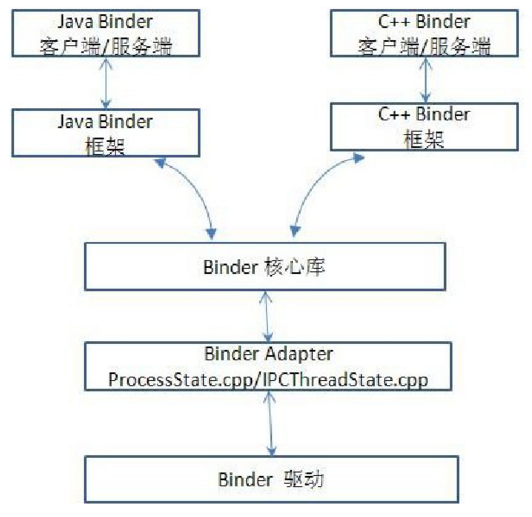
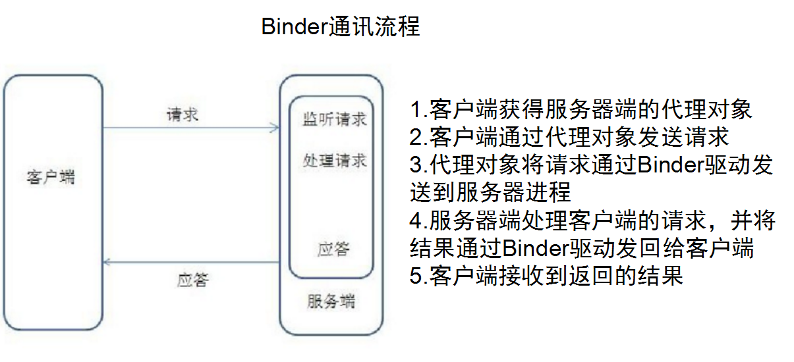

# 为面试做的一些准备

> The Chance should be taked by the one who was ready !  

下面是一些面试中常考的Android知识点归纳。

持续更新中~~

## Activity 生命周期

在Activity的生命周期中，如下的方法会被系统回调：

onCreate(Bundle savedInstanceState)            Activity被创建时调用。

onStart()					  Activity已经启动，但还不可以与用户进行交互。

onResume()					  当Activity可见，并准备与用户交互。

onPause()				  	  暂停Activity时被调用，调用了该方法后，Activity变得不可交互。

onStop()					  停止Activity时被调用，Activity变得不可见。

onDestroy()					  销毁Activity时被调用。

onRestart()					  重启Activity时被调用，当Activity从不可见重新变为可见时，就会调用该方法。

## Activity的四种加载模式以及使用场景

**standard 模式**

这是默认模式，每次激活Activity时都会创建Activity实例，并放入任务栈中。使用场景：大多数Activity。

**singleTop 模式**

如果在任务的栈顶正好存在该Activity的实例，就重用该实例( 会调用实例的 onNewIntent() )，否则就会创建新的实例并放入栈顶，即使栈中已经存在该Activity的实例，只要不在栈顶，都会创建新的实例。使用场景如新闻类或者阅读类App的内容页面。

**singleTask 模式**

如果在栈中已经有该Activity的实例，就重用该实例(会调用实例的 onNewIntent() )。重用时，会让该实例回到栈顶，因此在它上面的实例将会被移出栈。如果栈中不存在该实例，将会创建新的实例放入栈中。使用场景如浏览器的主界面。不管从多少个应用启动浏览器，只会启动主界面一次，其余情况都会走onNewIntent，并且会清空主界面上面的其他页面。

**singleInstance 模式**

在一个新栈中创建该Activity的实例，并让多个应用共享该栈中的该Activity实例。一旦该模式的Activity实例已经存在于某个栈中，任何应用再激活该Activity时都会重用该栈中的实例( 会调用实例的 onNewIntent() )。其效果相当于多个应用共享一个应用，不管谁激活该 Activity 都会进入同一个应用中。使用场景如闹铃提醒，将闹铃提醒与闹铃设置分离。singleInstance不要用于中间页面，如果用于中间页面，跳转会有问题，比如：A -> B (singleInstance) -> C，完全退出后，在此启动，首先打开的是B。

## 如何理解Activity，View，Window三者之间的关系？

打个比方。Activity像一个工匠（控制单元），Window像窗户（承载模型），View像窗花（显示视图）LayoutInflater像剪刀，Xml配置像窗花图纸。

1：Activity构造的时候会初始化一个Window，准确的说是PhoneWindow。

2：这个PhoneWindow有一个“ViewRoot”，这个“ViewRoot”是一个View或者说ViewGroup，是最初始的根视图。

3：“ViewRoot”通过addView方法来一个个的添加View。比如TextView，Button等

4：这些View的事件监听，是由WindowManagerService来接受消息，并且回调Activity函数。比如onClickListener，onKeyDown等。

## Activity与Fragment通信

## Service

Service有两类：

**1：本地服务**， Local Service 用于应用程序内部。在Service可以调用Context.startService()启动，调用Context.stopService()结束。 在内部可以调用Service.stopSelf() 或 Service.stopSelfResult()来自己停止。无论调用了多少次startService()，都只需调用一次 stopService()来停止。

**2：远程服务**， Remote Service 用于android系统内部的应用程序之间。可以定义接口并把接口暴露出来，以便其他应用进行操作。客户端建立到服务对象的连接，并通过那个连接来调用服 务。调用Context.bindService()方法建立连接，并启动，以调用 Context.unbindService()关闭连接。多个客户端可以绑定至同一个服务。如果服务此时还没有加载，bindService()会先加 载它。
提供给可被其他应用复用，比如定义一个天气预报服务，提供与其他应用调用即可。使用远程服务需要借助AIDL来进行跨进程通讯。

Service生命周期图一：

通过start方式启动Service，则生命周期函数调用为：
context.startService() ->onCreate()- >onStartCommand()->Service running--调用context.stopService() ->onDestroy() 

通过bind方式启动Service:
context.bindService()->onCreate()->onBind()->Service running--调用>onUnbind() -> onDestroy() 

Service生命周期图二：

Service生命周期图三：

**同一服务，多次使用start()启动时**

第一次 启动服务时，运行 onCreate -->onStartCommand

后面在启动服务时，服务只执行onStartCommand，不再执行OnCreate

**同一服务A，用任何组件多次bind服务A时**

第一次绑定时会调用onCreate->onBind()。随后无论哪个组件再绑定几次该Service。服务A的onCreate()和onBind()只调用一次。

## Binder机制原理

[Linux](http://lib.csdn.net/base/linux)已经拥有的进程间通信IPC手段包括(Internet Process Connection)： 管道（Pipe）、信号（Signal）和跟踪（Trace）、插口（Socket）、报文队列（Message）、共享内存（Share Memory）和信号量（Semaphore）。

而Android采用的是Binder。**Binder基于Client-Server通信模式，传输过程只需一次拷贝，为发送发添加UID/PID身份，既支持实名Binder也支持匿名Binder，安全性高。**

Binder框架定义了四个角色：Server，Client，ServiceManager（以后简称SMgr）以及Binder驱动。其中Server，Client，SMgr运行于用户空间，驱动运行于内核空间。

### Binder机制包括以下五个部分：

* Binder驱动

  ​Binder驱动的核心是维护一个binder_proc类型的链表。里面记录了包括ServiceManager在内的所有Client信息，当Client去请求得到某个Service时，Binder驱动就去binder_proc中查找相应的Service返回给Client，同时增加当前Service的引用个数。

* Service Manager

  ​	Service Manager主要负责管理Android系统中所有的服务，当客户端要与服务端进行通信时，首先就会通过Service Manager来查询和取得所需要交互的服务。每个服务需要向Service Manager注册自己提供的服务。

* 服务端

  ​	通常是Android的系统服务，通过Service Manager可以查询和获取到某个Server。

* 客户端

  ​	一般指Android系统上的应用程序，它可以请求Server中的服务，常见的客户端是Activity。

* 服务代理

  ​	服务代理是指在客户端应用程序中生成的Server代理(Proxy)，从应用程序的角度看，代理对象和本地对象没有差别，都可以调用其方法，方法都是同步的，并且返回相应的结果。服务代理也是Binder机制的核心模块。

**Binder系统架构图**:

**Binder各组件之间的关系：**

**Binder通讯流程**

## Handler实现原理

## 自定义View 		

## View的绘制流程

## Touch事件的传递机制

## Android中的几种动画

## 跨进程通讯有几种方式

## AIDL

## 热修复的原理

